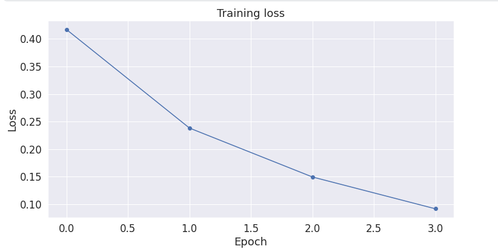

# Project Title

* This repository holds an attempt to apply the pre-trained model BERT to news comments from the "Jigsaw Unintended Bias in Toxicity Classification" Kaggle challenge in order to detect toxicity in these news comments. 
* https://www.kaggle.com/competitions/jigsaw-unintended-bias-in-toxicity-classification

## Overview

* This section could contain a short paragraph which include the following:
  * **Definition of the tasks / challenge**  Ex: The task, as defined by the Kaggle challenge is to use a time series of 12 features, sampled daily for 1 month, to predict the next day's price of a stock.
  * **Your approach** Ex: The approach in this repository formulates the problem as regression task, using deep recurrent neural networks as the model with the full time series of features as input. We compared the performance of 3 different network architectures.
  * **Summary of the performance achieved** Ex: Our best model was able to predict the next day stock price within 23%, 90% of the time. At the time of writing, the best performance on Kaggle of this metric is 18%.

## Summary of Workdone

Include only the sections that are relevant an appropriate.

### Data

* Data:
  * Type: The data is reprseneted in csv files which have many features however we will only focus on one column for this challenge and that is the comment_text column which displays each users comment. This is what will be our input variable. Our target or output variable will be the target column which contains the ratio of people who rated specific comment toxic.
   
  * Size: There is about 1.21GB of data given by the challenge
  * The challenge gives us a training set of over 1 million data points and 100000 test points however for the sake of time we will only use 100000 training points 100000 test points and we will set aside 20000 data points for validation. 1
#### Preprocessing / Clean up

* I had to do some preprocessing on the comment text before I could put it into the model. This involved lemmatizing the words, removing special characters, removing stop words, and punctuation. 
* Per the challenge's request in the target column I made it so that if the value was greater than or equal to 0.5 then I would change to 1 and if it was less than 0.5 I would change it to a 0. 

#### Data Visualization

Show a few visualization of the data and say a few words about what you see.

### Problem Formulation

* Define:
  * Input = Comment Text
  * Output = Label(either 1 or 0 for toxic or not toxic)
  * Models
    * So far I have only used the pre trained BERT model using pytorch I do plan on either using different pretrained models or other simpler machine learning algorithms such as Bayes Algorithm. 
  * Loss = Binary Cross Entropy
  * Optimizer = AdamW
  * Epochs = 4
  * Batch Size = 32

### Training

* Describe the training:
  * How you trained: software and hardware.
  * How did training take.
  * Training curves (loss vs epoch for test/train).
  * How did you decide to stop training.
  * Any difficulties? How did you resolve them?

### Performance Comparison

* Clearly define the key performance metric(s).
* Show/compare results in one table.
* Show one (or few) visualization(s) of results, for example ROC curves.

### Conclusions

* State any conclusions you can infer from your work. Example: LSTM work better than GRU.

### Future Work

* What would be the next thing that you would try.
* What are some other studies that can be done starting from here.

## How to reproduce results

* In this section, provide instructions at least one of the following:
   * Reproduce your results fully, including training.
   * Apply this package to other data. For example, how to use the model you trained.
   * Use this package to perform their own study.
* Also describe what resources to use for this package, if appropirate. For example, point them to Collab and TPUs.

### Overview of files in repository

* Describe the directory structure, if any.
* List all relavent files and describe their role in the package.
* An example:
  * utils.py: various functions that are used in cleaning and visualizing data.
  * preprocess.ipynb: Takes input data in CSV and writes out data frame after cleanup.
  * visualization.ipynb: Creates various visualizations of the data.
  * models.py: Contains functions that build the various models.
  * training-model-1.ipynb: Trains the first model and saves model during training.
  * training-model-2.ipynb: Trains the second model and saves model during training.
  * training-model-3.ipynb: Trains the third model and saves model during training.
  * performance.ipynb: loads multiple trained models and compares results.
  * inference.ipynb: loads a trained model and applies it to test data to create kaggle submission.

* Note that all of these notebooks should contain enough text for someone to understand what is happening.

### Software Setup
* List all of the required packages.
* If not standard, provide or point to instruction for installing the packages.
* Describe how to install your package.

### Data

* Point to where they can download the data.
* Lead them through preprocessing steps, if necessary.

### Training

* Describe how to train the model

#### Performance Evaluation

* Describe how to run the performance evaluation.

## Citations

* Provide any references.

