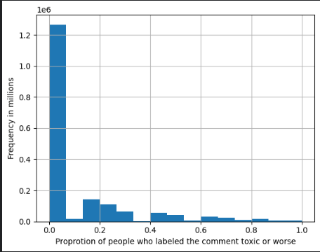

# Project Title

* This repository holds an attempt to apply the pre-trained model BERT to news comments from the "Jigsaw Unintended Bias in Toxicity Classification" Kaggle challenge in order to detect toxicity in these news comments. 
* https://www.kaggle.com/competitions/jigsaw-unintended-bias-in-toxicity-classification

## Overview
  The task, as defined by the Kaggle challenge is to classify toxic news comments while making sure our model does not have any unintended bias's towards certain identities. 
  My approach in this repository will be to use Pre-trained models as well as Baye's algorithm to classify the text. The pre-trained models will be my attempt to get the best evaluation scores and Baye's algorithm will be a model that will be fast and lightweight in case of use on a smaller device. 
  Our best model was able to achieve an F1 score of 0.91.

## Summary of Workdone

### Data

* Data:
  * Type: The data is reprseneted in csv files which have many features however we will only focus on one column for this challenge and that is the comment_text column which displays each users comment. This is what will be our input variable. Our target or output variable will be the target column which contains the ratio of people who rated the specific comment toxic or worse. 
   
  * Size: There is about 1.21GB of data given by the challenge
  * The challenge gives us a training set of over 1 million data points and 100000 test points. However because the data is very imbalanced so I decided to downsample the data which brings the amount of training examples to about 340,000. And we will set aside 20% of that for validation.
#### Preprocessing / Clean up
* As mentioned before I decided to downsample the data so that it would be more balanced and so that my model wouldn't over train on one class. 
* I had to do some preprocessing on the comment text before I could put it into the model. This involved lemmatizing the words, removing special characters, removing stop words, and punctuation. 
* Per the challenge's request in the target column I made it so that if the value was greater than or equal to 0.5 then I would change to 1 and if it was less than 0.5 I would change it to a 0. 

#### Data Visualization

### Problem Formulation

* Define:
  * Input = Comment Text
  * Output = Label(either 1 or 0 for toxic or not toxic)
  * Models
    * The models I used were the pre trained BERT model using pytorch, Distilled BERT with Tensorflow, GPT2 with Tensorflow, and Naive Baye's Algorithm.
  * Loss = Binary Cross Entropy
  * Optimizer = AdamW
  * Epochs = 5
  * Batch Size = 32

### Training

* Describe the training:
  * I used Kaggle notebooks for my pytorch model and then I switched over to Google Colab when I wanted to use tensorflow this was because I wanted to use TPU's to speed up training time. 
  * For the Pytorch model each epoch took about 2 hours this was with using their gpu's as well. On Google Colab using Tensorflow and TPU's each epoch took about 15 minutes. 
  * 
  * I decided to stop training once I noticed that the validation accuracy was going down after a certain epoch.
  * Training time was a problem which was one of the reasons I swapped to Tensorflow and used TPU's.
  * Another problem was overfitting. The model's on Tensorflow had a habit of overfitting and for whatever reason the loss would have a steep decline after the first epoch as shown in the graphs. Validation accuracy would quickly plateau after the first epoch and start decreasing after more than 2 epochs. This was a problem I was struggling to solve. I had tried many variations of hyperparameters, such as changing the learning rate, changing regularization strength, number of epochs, number of training examples, and layer amount. However none seemed to fix the issue. 

### Performance Comparison

* Main Performance metrics will be the AUC for ROC curve and F1 score.
* Show/compare results in one table.
* Show one (or few) visualization(s) of results, for example ROC curves.

### Conclusions

* Whilst using both Tensorflow and Pytorch for this project I can see that both have their merits. While pytorch allows you to customize everything from top to bottom and allows for very fine-tuned models. Tensorflow is much easier to use and allows for the use of TPU's which drastically increase training speeds. While both performed simarily the Pytorch model seemed to generalize a little better than the Tensorflow one. Baye's Algorithm is a great choice for very quick results as it only took about 3 seconds for the model to run and it outputted results extremely quick. This could be used for any device that does not want to expend great computing power to get a result that is decently accurate. 

### Future Work

* I would like to investigate how to reduce overfitting in these pre-trained models. It could be that because the models are pre-trained they really do need very few epochs to train and thus if trained any longer we get diminishing returns.
* One thing I could look into is getting more toxic comments from various websites such as Youtube and Twitter and using those in order to get a more robust dataset.
* One thing to note is that I did not use the full dataset given to me by the kaggle challenge and there were several columns of different categorical variables. Perhaps using theese columns can allow for a better model. 

## How to reproduce results
* In order to reproduce these results you can do these in the following order:
* 1st load up the data set and clean up the text however you like feel free to use the function in the notebook
* Next downsample the data I used a 40-60 split 40 being the minority class. 
* Next Tokenize the data using the respective pre-trained model's tokenizer
* Be sure to save input ids using pickle or some other package so that when you want to re-train the model you don't have to create the ids again.
* Now you can split your ids in training and validation and initialize the model. 
* Then you fine-tune your model and wait for the results!

### Overview of files in repositor

* Describe the directory structure, if any.
* List all relavent files and describe their role in the package.
* An example:
  * utils.py: various functions that are used in cleaning and visualizing data.
  * preprocess.ipynb: Takes input data in CSV and writes out data frame after cleanup.
  * visualization.ipynb: Creates various visualizations of the data.
  * models.py: Contains functions that build the various models.
  * training-model-1.ipynb: Trains the first model and saves model during training.
  * training-model-2.ipynb: Trains the second model and saves model during training.
  * training-model-3.ipynb: Trains the third model and saves model during training.
  * performance.ipynb: loads multiple trained models and compares results.
  * inference.ipynb: loads a trained model and applies it to test data to create kaggle submission.

* Note that all of these notebooks should contain enough text for someone to understand what is happening.

### Software Setup
* List all of the required packages.
* If not standard, provide or point to instruction for installing the packages.
* Describe how to install your package.

### Data

* Point to where they can download the data.
* Lead them through preprocessing steps, if necessary.

### Training

* Describe how to train the model

#### Performance Evaluation

* Describe how to run the performance evaluation.

## Citations

* Provide any references.

